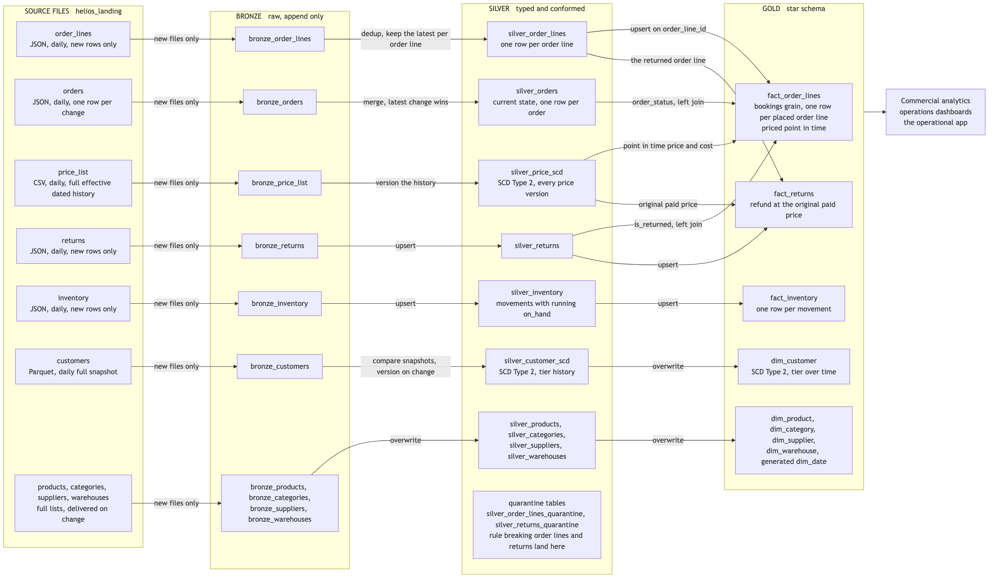
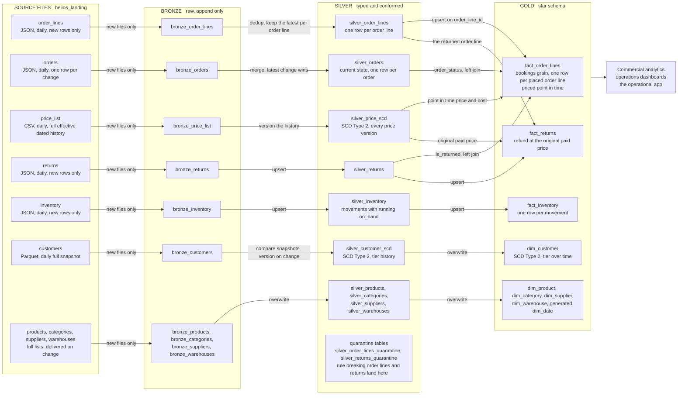

# Helios Trading Corporation: Lakehouse Design

The build plan for the Helios lakehouse, agreed off the data contract (`2_3_data_contract.md`). Data moves one way, table to table, from the source files to a star schema. Follow any feed left to right to see every table it becomes. This document is the high level picture; the contract holds the schemas, keys and rules each layer enforces.

The blueprint is implemented twice, imperatively with Databricks Jobs and declaratively with Lakeflow, both landing the same Gold.

---

## The flow

One direction of travel. Files land, Bronze copies them faithfully, Silver makes them trustworthy, Gold makes them answerable. Each layer can be rebuilt from the layer beneath it, all the way down to the files, so nothing is ever lost by a bad run.

## Landing

- Every feed arrives as files in the Volume, one folder per feed, one new drop folder per delivery. Nothing is pushed and nothing arrives cleaned.
- Three formats. Parquet arrives typed; JSON and CSV are text until the pipeline applies the contract types.
- Landed files are read, never edited. They are the permanent record of what the sources sent.

## Bronze: raw, append only

- One table per feed, the raw columns exactly as they arrived, plus ingest metadata recording when each row was loaded, which file it came from, and anything that did not fit the expected schema.
- Ingestion is incremental. Each run picks up only the files it has not seen before, so a run does the same small amount of work whether it is day one or day one thousand.
- No business logic. Bad rows are stored as they arrived; fixing them is Silver's job, and keeping them here is what makes any downstream question auditable.
- A new upstream column is absorbed, not a load failure.

## Silver: the contract enforced

- Every column gets its agreed type, including money as `DECIMAL`, never floating point.
- One row per entity. Order lines are deduplicated keeping the latest row per `order_line_id`. The orders change feed is reduced to current state, one row per `order_id`, taking the highest `change_seq` and treating a DELETE as a purged cancellation.
- Quality rules are enforced at the door. A bad quantity or a missing product on an order line, and a return that points at an unknown order line or is dated before it, are quarantined, kept and counted, never silently dropped.
- Primary keys are enforced. The declarative build halts the load on a missing key, and the Jobs build closes every run with a self check task that fails the run if the built tables break their invariants.
- Quarantined rows stay visible in their own tables, and the order line quarantine keeps the depot on the row, so bad data can be traced back to where it came from.

## History: the two slowly changing dimensions

- Prices and customer tiers change over time, and the business reports at the value in force on the day. So neither is overwritten.
- Each change becomes a new version row with `effective_from`, `effective_to` and an `is_current` flag, keyed by a surrogate key per version (`price_sk`, `customer_sk`). Exactly one current row per product and per customer, with contiguous, non overlapping ranges.
- Each delivery is folded into the version history in one pass, so the history stays correct even when several deliveries land together.

## Gold: the star schema

- Three facts at fixed grains. One row per order line, one per return, one per stock movement.
- Around them the conformed dimensions, product, customer, supplier, warehouse and category, plus a generated `dim_date` keyed by a `date_key` integer. Order ids ride on the sales fact as degenerate dimensions.
- `fact_order_lines` is a bookings grain. Every placed order line keeps its row, including order lines whose order was later cancelled or is still in flight, so revenue and units measured on it are gross bookings. Each order line carries `order_status`, the order's current lifecycle status, left joined from the current state `silver_orders` (one row per order there, so the join cannot fan out). It is NULL when the order has no current record, a purged cancellation or a change that has not arrived yet. A consumer nets out cancellations by excluding `order_status = 'CANCELLED'`; the semantic layer's Net Revenue and Net Units Sold do exactly that. A return never removes or reduces an order line: `is_returned` flags it and `fact_returns` carries the refund.
- Point in time everywhere money appears. A sale is valued at the price version whose effective range covers its `line_ts`, a return refunds the price the customer actually paid, and the join never fans out, one row per order line stays one row.
- The three facts are written incrementally, upserted on their business keys, so each run adds only the new events. The dimensions are small, so all of them are rebuilt in full from Silver on every run, which keeps a re-run producing exactly the same result.
- No aggregates in Gold. Revenue, margin and the other metrics are defined once in the semantic layer above it, so every consumer agrees on the same numbers.

## Rules of the build

- Incremental everywhere the data is big. Every feed is picked up incrementally into Bronze, and the big tables, the facts and the Silver event tables, are upserted. Only the small tables are rebuilt in full each run, the reference lists in Silver and the dimensions in Gold.
- Rerunnable. Running the same load twice lands the same state, with no duplicates and no double counting.
- Each engineer works in their own catalog (`labs_<userid>`), with schemas `helios_bronze`, `helios_silver` and `helios_gold`, and the landing Volume `helios_raw.helios_landing`.

---

## Diagram source

The image above is rendered from this Mermaid definition (it renders directly on GitHub and in VS Code; regenerate the PNG from it whenever the flow changes).

