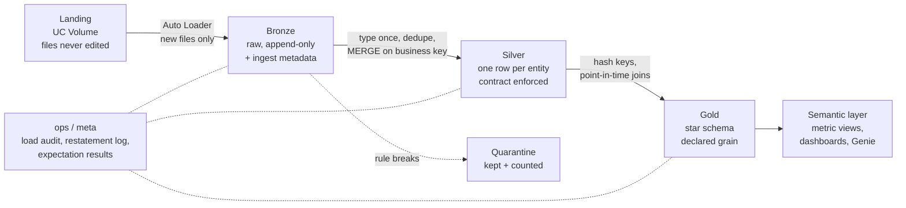

# Databricks Data Engineering Portfolio

**Production-style lakehouses on Databricks: Kimball dimensional models, incremental ELT, streaming, and data quality you can verify.**

Each project starts from a real or synthetic dataset and is fed by **dated incremental drops designed to break a naive pipeline**: late files, restatements, re-sends, schema drift, orphan rows, partial deliveries, out-of-order events. Every project ships with a **deterministic data generator and an answer key**, so "it works" is a row-count assertion, not an opinion.

> **Author:** Patrick Okare, Data Engineer (9+ years: enterprise SaaS, financial services, healthcare)
> **Contact:** [LinkedIn](https://www.linkedin.com/in/patrickokare) · patrickbabawale@gmail.com

---

## Reviewer's 2-minute tour

| If you want to see… | Go to |
|---|---|
| Kimball modelling depth (grain, bus matrix, SCD2, accumulating and periodic snapshots) | [Kimball patterns coverage](#kimball-patterns-coverage) |
| How I handle messy incremental data | Any project's **Drop catalogue** in its README |
| Design judgement and trade-offs | `docs/` in each project (ADRs) |
| Proof the pipeline is correct | The answer key in `docs/` + the self-check task in `bundles/` |
| Streaming, CDC and serving | [Project 4: Helios](#4-helios-trading-lakehouse--streaming-data-platform) |
| Performance engineering | The performance log in each project's `docs/` |

---

## Projects

| # | Project | Business question | Headline pattern | Status |
|---|---|---|---|---|
| 1 | [Formula 1 Racing Lakehouse](./01-formula1-lakehouse) | Driver, constructor and pit-strategy performance across 70+ seasons | Transaction facts, SCD2, restatements, inferred members | 🚧 In progress |
| 2 | [UK Rail Tickets & Punctuality](./02-uk-rail-analytics) | Which delays become refund claims, and what they cost | 3 business processes, role-playing and junk dimensions, **accumulating snapshot** | 🚧 In progress |
| 3 | [Video Game Sales Analytics](./03-video-game-sales) | Sales trends by platform, region, genre and publisher over time | **Periodic snapshot**, semi-additive measures, AUTO CDC SCD2, scale testing | 🚧 In progress |
| 4 | [Helios Trading Platform](./04-helios-trading-platform) | Order-to-cash for a parts distributor across 6 depots | 10 feeds, 4 arrival patterns, CDC, streaming Silver, Lakebase serving + Databricks App | 🚧 In progress |

Projects are built in this order on purpose: each one adds a harder pattern on top of the last.

---

## Engineering standards (all projects)



| Principle | How it is enforced |
|---|---|
| **Arrival pattern decides processing** | Append-only → incremental + dedupe. CDC → sequence-aware. Full snapshot → compare or overwrite. Event-driven reference → replace. |
| **Idempotent by construction** | Auto Loader checkpoints + MERGE on natural keys. A re-sent file or rerun produces zero net change, and every project includes a byte-for-byte re-send to prove it. |
| **Type once, in Silver** | Bronze keeps raw strings + `_rescued_data`. Money is `DECIMAL`, never floating point. |
| **Never silently drop a row** | Rule breakers go to quarantine with a reason code. Per-drop reconciliation: `landed = accepted + quarantined + duplicates removed`. |
| **Deterministic surrogate keys** | `xxhash64(natural_key[, effective_from])`. Rebuilds never re-key facts; late-arriving dimensions get inferred members under their final key. |
| **Completeness before publish** | A `_manifest.json` per drop. A promised-but-missing file marks the period `PENDING` and blocks Gold. |
| **Auditable restatements** | Corrections update in place and write old/new values to a restatement log; Delta time travel reproduces any published number. |
| **Governed** | Unity Catalog catalogs/schemas per project, managed tables and Volumes, least-privilege grants, lineage. |
| **Measured, not assumed** | Spark UI and `system.billing` numbers recorded before and after each optimisation. |

---

## Kimball patterns coverage

| Pattern | F1 | Rail | Video Games | Helios |
|---|:-:|:-:|:-:|:-:|
| Transaction fact | ✅ | ✅ | | ✅ |
| Periodic snapshot (dense, carry-forward) | | | ✅ | |
| Accumulating snapshot (milestones fill in) | | ✅ | | |
| SCD Type 2 | ✅ constructor | | ✅ release | ✅ price, customer tier |
| Point-in-time joins | ✅ | | ✅ | ✅ price at sale/return time |
| Role-playing dimensions | | ✅ date, time, station | ✅ date | |
| Junk (combined) dimensions | | ✅ | | |
| Degenerate dimensions | ✅ | ✅ | | ✅ |
| Inferred members (late-arriving dims) | ✅ | ✅ | ✅ | |
| Semi-additive measures | | | ✅ cumulative sales | ✅ on-hand stock |
| Restatements | ✅ | ✅ | ✅ late rows | |
| CDC (sequence-aware) | | ✅ | ✅ AUTO CDC | ✅ AUTO CDC |
| Schema evolution mid-stream | ✅ | ✅ | ✅ | ✅ |
| Manifest completeness gate | ✅ | ✅ | ✅ | |

---

## 1. Formula 1 Racing Lakehouse

**Source:** Ergast F1 data, 1950–2020 history, then 13 dated 2021 deliveries (1 real, 12 simulated on the real grid and calendar).
**Model:** `fact_race_result`, `fact_qualifying`, `fact_pit_stop`, `fact_lap_time` · `dim_race`, `dim_driver`, `dim_constructor` (SCD2), `dim_status`, `dim_date`.

**Scenarios the pipeline must survive:** calendar restatement · constructor rename (SCD2 point-in-time) · new `compound` column · pit stops promised but not sent · post-race penalty restatement · driver racing before appearing in `drivers.json` · duplicate and zero-ms laps · orphan pit stop · byte-for-byte re-send · unmapped status code · lap-time split missing for a day.

**Target end state:** `fact_lap_time` = 502,728 · `fact_pit_stop` = 8,340 · `fact_race_result` = 25,160 · 2 restated results · 3 quarantined rows.

---

## 2. UK Rail Tickets & Punctuality

**Source:** 31,653 real UK rail ticket transactions, split into the three systems an operator actually runs (ticketing, operations, Delay Repay refunds) and delivered as 19 weekly drops.
**Model:** `fact_ticket_sale` (transaction) · `fact_train_service` (restatable transaction) · `fact_refund_claim` (**accumulating snapshot**: requested → decided → paid) · role-playing `dim_date`/`dim_time`/`dim_station` · junk `dim_ticket_product` and `dim_purchase_channel`.

**Key design call:** punctuality belongs to the *train*, not the ticket. Measuring on-time % per ticket overweights busy services, so it gets its own fact.

**Scenarios:** byte-for-byte re-send · new `Booking Channel` column · new railcard missing from reference data · late operations file · 25 service corrections · conflicting duplicate transaction · orphan refund event · refund approvals arriving after payment.

**Target end state:** 31,652 tickets · 19,871 services · 1,118 claims (£17,001.00 paid) · 25 restated services.

---

## 3. Video Game Sales Analytics

**Source:** 64,016 VGChartz releases turned into 12 weekly cumulative-sales snapshots by a deterministic generator (seed 42, `--scale N` for load tests).
**Model:** `fct_game_sales_snapshot` (**periodic snapshot**, release × week, cumulative + weekly delta) · `dim_release` (SCD2 via AUTO CDC) · `dim_console` (seeded) · `dim_publisher` · `dim_developer` · `dim_date`.

**Key design calls:** the source natural key is not unique (139 extra rows), so the generator issues a stable `release_id`; cumulative sales are semi-additive (never summed across weeks); opening balances are flagged so they do not inflate weekly velocity.

**Also covers:** dev/prod catalogs, Databricks Asset Bundles + GitHub Actions CI/CD, governance (groups, tags, column comments from a data dictionary), and a ×1 / ×10 / ×100 scale test with cost from `system.billing.usage`.

**Target end state:** 209,800 snapshot rows · 18,922 releases with sales · 661 SCD2 versions · 696 quarantined · 1,390 duplicates removed.

---

## 4. Helios Trading Lakehouse & Streaming Data Platform

**Scenario:** Helios Trading Corporation, a fictional interplanetary parts distributor in the year 2257, with 6 depots from Luna to Titan. Data links to the outer depots are unreliable, so late and duplicated data is part of the design.
**Source:** 10 feeds in 3 formats (JSON, CSV, Parquet), ~293,000 order lines across 5 deterministic batches.

| Arrival pattern | Feeds | Processing |
|---|---|---|
| New rows only | `order_lines`, `returns`, `inventory` | Stream from Bronze, `foreachBatch` MERGE, quarantine |
| Row per change (CDC) | `orders` | Latest by `change_seq` (never `change_ts`), DELETE = purged cancellation |
| Full snapshot daily | `customers`, `price_list` | Snapshot comparison → SCD2 |
| When changed | `products`, `categories`, `suppliers`, `warehouses` | Current-state overwrite |

**Gold:** `fact_order_lines` (bookings grain), `fact_returns`, `fact_inventory_movements` with point-in-time pricing. Net Revenue, Margin and Return Rate are defined once as metric views.

**Built twice, then served:**
1. **Imperative:** 5-task Databricks Job with retries, alerting, replay parameters and a self-check task.
2. **Declarative:** Lakeflow Declarative Pipelines with expectations and AUTO CDC, plus an incident runbook diagnosed from the event log.
3. **Semantic layer:** metric views → AI/BI dashboard + Genie space on one definition of revenue.
4. **Serving:** curated Gold synced to **Lakebase**, powering a **Databricks App** (Depot Operations Console) with freshness indicators and row-level access.

---

## Tech stack

**Platform:** Databricks (serverless), Unity Catalog, Delta Lake, Lakebase, Databricks Apps
**Processing:** PySpark, Spark SQL, Structured Streaming, Auto Loader, Lakeflow Jobs, Lakeflow Declarative Pipelines (AUTO CDC, expectations)
**Modelling:** Kimball dimensional modelling, medallion architecture
**Serving & BI:** metric views, AI/BI dashboards, Genie
**Engineering:** Databricks Asset Bundles, GitHub Actions, deterministic synthetic data generators, liquid clustering, Delta time travel

---

## Repository structure

```text
databricks-dataml/
├── README.md
├── 01-formula1-lakehouse/
│   ├── README.md     # project overview, status, results
│   ├── schema/       # Unity Catalog DDL: catalog, schemas, Volumes, tables, grants
│   ├── bundles/      # Databricks Asset Bundle: databricks.yml, jobs/pipelines, source code
│   └── docs/         # spec, ADRs, diagrams, answer key, performance log
├── 02-uk-rail-analytics/        # same layout
├── 03-video-game-sales/         # same layout
└── 04-helios-trading-platform/  # same layout
```

## Running a project

Each project README has exact steps. The general flow is:

1. Create the project catalog, schemas and landing Volume from `schema/`.
2. Run the project's deterministic data generator and upload the landing files and seeds to the Volume.
3. Deploy the bundle (`databricks bundle deploy` from `bundles/`) and run the pipeline once per drop, in date order.
4. Run the self-check, which compares every table to the answer key.

---

## Data sources & attribution

- **Formula 1:** Ergast Developer API dataset. 2021 drops after round 2 are simulated.
- **UK Rail** and **Video Game Sales:** [Maven Analytics Data Playground](https://mavenanalytics.io/data-playground). Refund events, booking channel and weekly snapshots are simulated.
- **Helios:** fully synthetic. Generator included.

Source datasets remain under their original terms. Simulated data is clearly marked in each project.
